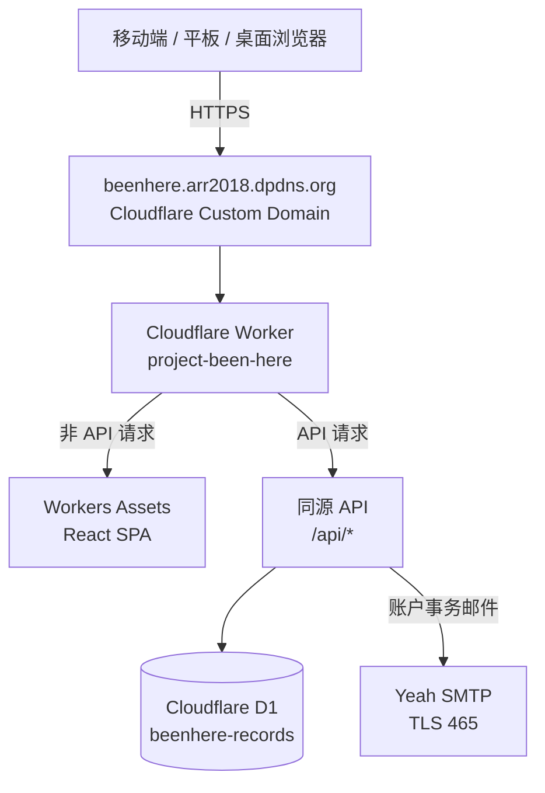
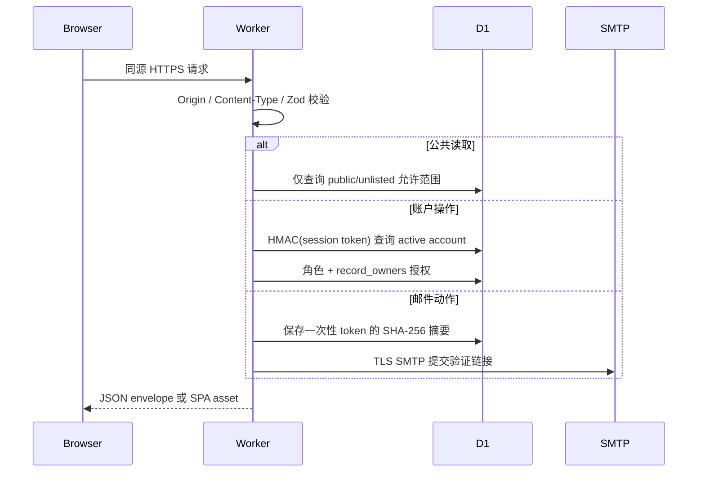
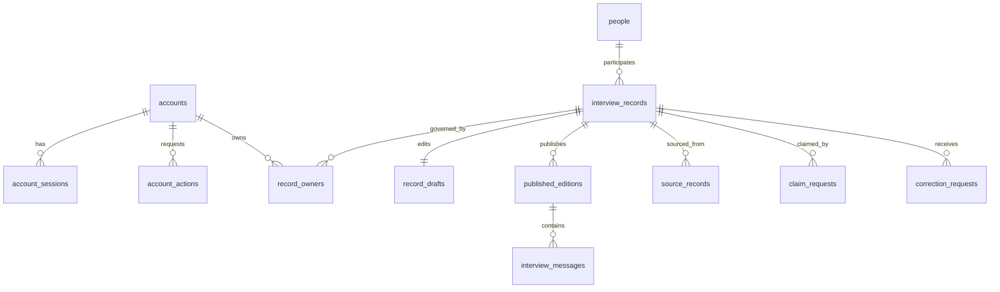

# 技术架构

本文描述当前已实现的唯一架构。生产域名只有 `beenhere.arr2018.dpdns.org`；系统没有 Cloudflare Access、匿名编辑、内容复核角色、旧 API 或兼容数据模型。

## 1. 运行时拓扑



Worker 是唯一应用入口。`/api/*` 必须先经过 Worker；其他路径由 Workers Assets 提供静态文件，未知前端路径回退到 `index.html`，由 React Router 处理。浏览器不直连 D1 或 SMTP。

## 2. 技术栈与源文件

| 层 | 当前实现 | 配置或入口 |
|---|---|---|
| UI | React 19、React Router 7、Tailwind CSS 4、Lucide | `apps/web/src/` |
| 构建 | Vite 8、Cloudflare Vite Plugin、TypeScript 7 | `apps/web/vite.config.ts` |
| API/计算 | Cloudflare Worker 模块化单体 | `apps/web/worker/index.ts` |
| 验证 | Zod 4 | `worker/index.ts` 的请求 schema |
| 数据 | Cloudflare D1 / SQLite | `apps/web/migrations/` |
| 邮件 | Worker TCP Socket → SMTP over TLS 465 | `worker/smtp.ts` |
| 测试 | Vitest、JSDOM | `*.test.ts(x)` |
| 部署 | GitHub Actions、Wrangler 4.127.1 | `.github/workflows/ci.yml` |

根 `package.json` 是 npm workspace 入口，当前只有 `apps/web` 一个 workspace 和一个部署单元。

## 3. 请求与安全边界



- 所有非 GET/HEAD/OPTIONS 请求必须携带与 `SITE_URL` 完全一致的 `Origin`；本地 `development` 例外仅允许 localhost/127.0.0.1。
- JSON API 统一返回 `{ "data": ... }`；错误统一为 `{ "error": { "code", "message" } }`。
- API 响应默认 `no-store`；静态响应设置 CSP、HSTS、frame、MIME、referrer 和 permissions 安全头。
- 完整认证、安全与限流规则见 [SECURITY.md](SECURITY.md)。

## 4. 前端路由

| 分组 | 路径 | 访问条件 |
|---|---|---|
| 公共 | `/`、`/records`、`/records/:recordNumber`、`/drift`、`/search`、人物/年份、`/method`、`/corrections` | 无需登录 |
| 认证 | `/auth/login`、`/auth/register`、找回密码与四类邮件确认页 | 无需登录 |
| 成员 | `/studio`、`/studio/new`、记录编辑、认领、`/account/settings` | active 会话 |
| 馆长 | `/director/accounts` | active 且 role=director |

`RequireAccount` 只负责前端体验；真正的身份与权限判断始终在 Worker 中执行。

## 5. 后端模块

| 模块 | 公开接口面 | 不变量 |
|---|---|---|
| `RecordRepository` | 列表、详情、漂流、搜索、聚合 | 私有和已删除记录永不进入公共查询。 |
| `AccountModule` | 注册、会话、资料、安全操作、馆长账户管理 | 密码/会话/邮件令牌不以明文入库。 |
| `RecordManagementModule` | 创建、更新、公开、删除、认领 | 成员必须是记录主人；馆长可管理全部；写操作带审计。 |
| `GovernanceModule` | 更正与撤回请求 | 公众只能提交请求，不能直接修改采访记录。 |

Web 模块目录约定见 [`apps/web/docs/README.md`](../apps/web/docs/README.md)，HTTP 契约见 [API.md](API.md)。

## 6. 数据模型



### 账户域

- `accounts`：唯一邮箱、显示名、密码派生值、邮箱验证时间、`member|director`、`pending|active|suspended|deleted`。
- `account_sessions`：30 天会话的 HMAC-SHA-256 摘要；Cookie 中才有原始随机令牌。
- `account_actions`：注册验证、密码重设、换邮箱、删号的一次性 SHA-256 令牌摘要；30 分钟过期。
- `auth_rate_limits`：认证动作的 15 分钟计数桶。

### 采访记录域

- `people`：被采访者公开身份，支持实名、化名、匿名；公开路径由系统生成。
- `interview_records`：记录根实体、公开编号、visibility、当前公开版本、软删除信息，以及从消息派生的标题和摘要。
- `record_owners`：编辑授权的唯一来源；`uploader|claimed|assigned`。
- `record_drafts`：当前精简 JSON 草稿和递增 revision，用于乐观并发控制；草稿只包含 participant、conductedAt、messages 与 source。
- `published_editions`：不可变 JSON 快照、版本号、变更说明和 SHA-256 内容摘要。
- `interview_messages`：当前公开版本的有序纯文本消息，角色只允许 `interviewer|participant`。
- `source_records`：抖音、其他社交媒体、线下、直接采访或其他来源。

### 治理域

- `claim_requests`：申请文本、状态、审阅者、审阅说明；获批后写入 `record_owners`。
- `correction_requests`：公众更正、隐私、授权、补充和撤回请求。
- `audit_events`：采访记录关键写操作的操作者、理由与目标。
- `public_request_limits`：公众更正接口的一小时计数桶。

数据库定义只来自顺序迁移。已在生产应用的迁移不得修改；新增 schema 必须增加新的编号文件。

## 7. 核心状态流

### 账户

```text
register → pending → verify_email → active
active ──馆长停用──> suspended ──馆长恢复──> active
active ──邮件确认删除──> deleted（资料匿名化、会话与凭据清除）
```

密码重设、修改密码和确认换邮箱都会撤销旧会话。修改密码与确认邮箱还会清除其他未消费安全动作。

### 采访记录

```text
创建草稿(private, revision=1)
  → 粘贴/校对双角色消息并编辑（expectedRevision 乐观锁）
  → 公开（分配 BH-000001 编号，生成 immutable edition）
  → 再编辑 / 再公开（新 edition，不覆盖旧版本）
  → 软删除(deleted，停止公开，保留历史与审计)
```

公共列表、搜索与漂流只读取 `public`；详情允许通过稳定编号读取 `public` 与 `unlisted`；`private`、`deleted` 永不公开。

## 8. 权限矩阵

| 能力 | 路人 | 成员 | 记录主人 | 馆长 |
|---|---:|---:|---:|---:|
| 阅读公开采访记录 | ✓ | ✓ | ✓ | ✓ |
| 提交更正/撤回请求 | ✓ | ✓ | ✓ | ✓ |
| 创建采访记录 |  | ✓ | ✓ | ✓ |
| 修改、公开、软删除 |  |  | 自己拥有 | 全部 |
| 提交认领申请 |  | ✓ | ✓ | ✓ |
| 审阅收到的认领申请 |  |  | 自己拥有 | 全部 |
| 停用/恢复普通成员 |  |  |  | ✓ |

## 9. 一致性与失败策略

- 相关 D1 写入使用 `DB.batch()`，失败时整批回滚。
- 草稿更新依赖 `expectedRevision`；冲突返回 409，客户端必须重新加载，不能静默覆盖。
- SMTP 发送失败时撤销新建的一次性令牌；注册账户可保持 pending 并重新注册触发新邮件。
- 忘记密码始终返回相同成功文案，降低账户枚举风险；实际邮件失败只写 Worker 错误日志。
- 未处理异常对外统一返回 500 通用文案，详细错误只进入 Worker 日志。

## 10. 已知架构边界

- 当前是单一生产环境，没有独立 staging Worker 或 staging D1。
- 当前没有 MFA、验证码、人机挑战或外部告警系统。
- 馆长角色由 `SUPERADMIN_EMAILS` 在注册时决定；修改该 Secret 不会自动改变已存在账户角色。
- 过期会话、邮件动作和限流桶没有定时任务；按[运维手册](OPERATIONS.md)执行周期清理。
- D1 Time Travel 是短期恢复手段，不是长期独立归档。

## 11. 相关文档

- [API 契约](API.md)
- [部署架构](DEPLOYMENT.md)
- [运维手册](OPERATIONS.md)
- [安全模型](SECURITY.md)
- [Cloudflare Worker + D1 架构决策](adr/0001-final-product-architecture.md)
