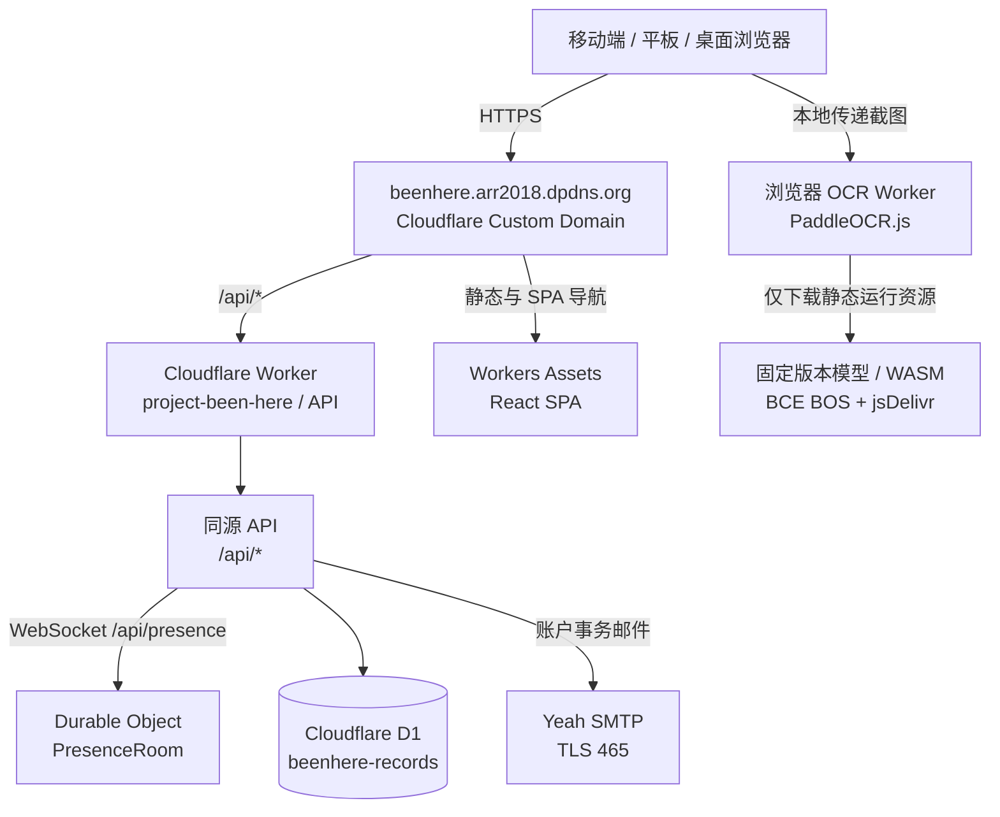
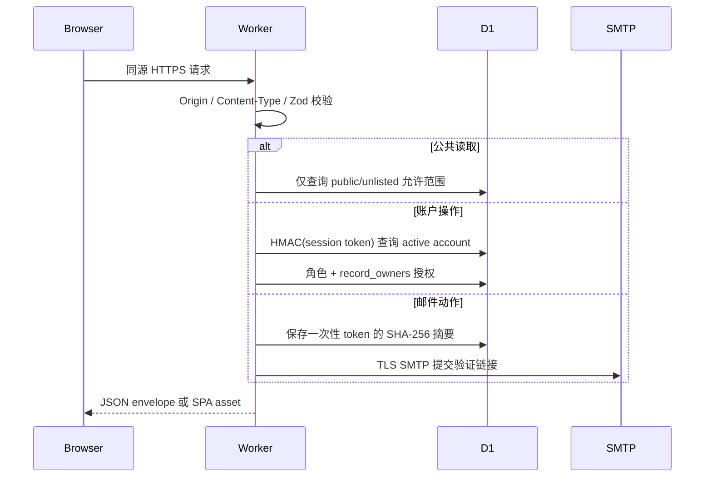
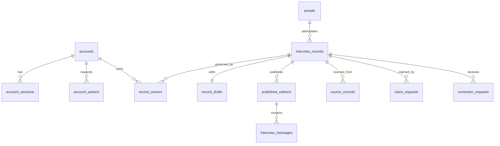

# 技术架构

本文描述当前已实现的唯一架构。生产域名只有 `beenhere.arr2018.dpdns.org`；系统没有 Cloudflare Access、匿名编辑、内容复核角色、旧 API 或兼容数据模型。

## 1. 运行时拓扑



`project-been-here` 是唯一 Cloudflare 部署单元，但静态与 API 有不同执行路径。`assets.run_worker_first=["/api/*"]` 使 `/api/*` 先进入 Worker 模块；已有静态文件及 SPA 导航由 Workers Assets 直接提供，未知前端路径按 `single-page-application` 回退到 `index.html`。因此静态安全头的事实源是 `public/_headers`，`worker/http.ts` 负责 API 和 Worker 回退响应。浏览器不直连 D1 或 SMTP。OCR 是浏览器内计算：截图只传给本站静态提供的专用 Web Worker；该 Worker 从固定第三方地址下载模型与 WASM，但不向这些地址发送截图。

## 2. 技术栈与源文件

| 层 | 当前实现 | 配置或入口 |
|---|---|---|
| UI | React 19.2.8、React DOM 19.2.8、React Router 7.18.3、Tailwind CSS 4.3.3、Lucide React 1.38.0 | `apps/web/src/`、`package-lock.json` |
| 构建 | Vite 8.2.2、Cloudflare Vite Plugin 1.54.2、TypeScript 7.0.2 | `apps/web/vite.config.ts`、`package-lock.json` |
| API/计算 | Cloudflare Worker 模块化单体 | `apps/web/worker/index.ts` |
| Worker 运行时 | compatibility date `2026-08-25`、`global_fetch_strictly_public`、Web Crypto、`cloudflare:sockets` | `apps/web/wrangler.jsonc` |
| 验证 | Zod 4.5.4 | `worker/index.ts` 的请求 schema |
| 数据 | Cloudflare D1 / SQLite | `apps/web/migrations/` |
| 实时协调 | Cloudflare Durable Object / WebSocket Hibernation | `worker/presence.ts`、`wrangler.jsonc` |
| 截图识别 | PaddleOCR.js 0.4.2 / PP-OCRv6 tiny / ONNX Runtime Web 1.24.3 WASM | `src/lib/ocr.ts`、`src/lib/ocr-conversation.ts` |
| 邮件 | Worker TCP Socket → SMTP over TLS 465 | `worker/smtp.ts` |
| 测试 | Vitest 4.1.11（Node 环境；个别 DOM 测试显式使用 JSDOM 30.0.1） | `vitest.config.ts`、`*.test.ts(x)` |
| 部署 | GitHub Actions、Wrangler 4.127.1 | `.github/workflows/ci.yml` |

根 `package.json` 是 npm workspace 入口，当前只有 `apps/web` 一个 workspace 和一个部署单元。版本事实以 `package-lock.json` 的解析结果为准；`package.json` 中使用范围声明的依赖不应被文档误写成永久固定版本。

## 3. 请求与安全边界



- 所有非 GET/HEAD/OPTIONS 请求必须携带与 `SITE_URL` 完全一致的 `Origin`；本地 `development` 例外仅允许 localhost/127.0.0.1。
- 在线 WebSocket 握手虽为 GET，仍必须携带与 `SITE_URL` 完全一致的 `Origin`；外站不能借用连接抬高人数。
- JSON API 统一返回 `{ "data": ... }`；错误统一为 `{ "error": { "code", "message" } }`。
- API 响应默认 `no-store`；Workers Assets 通过 `_headers` 设置 CSP、HSTS、frame、MIME、referrer 和 permissions 安全头。主页面 CSP 与 OCR vendor Worker CSP 分离，后者只为锁定运行时额外开放所需权限。
- 完整认证、安全与限流规则见 [SECURITY.md](SECURITY.md)。

## 4. 前端路由

| 分组 | 路径 | 访问条件 |
|---|---|---|
| 公共 | `/`、`/records`、`/records/:recordNumber`、`/drift`、`/search`、人物/年份、`/method`、`/corrections` | 无需登录 |
| 认证 | `/auth/login`、`/auth/register`、找回密码与四类邮件确认页 | 无需登录 |
| 成员 | `/studio`、`/studio/interview`、`/studio/new`、记录编辑、认领、`/account/settings` | active 会话 |
| 馆长 | `/director/accounts` | active 且 role=director |

`RequireAccount` 只负责前端体验；真正的身份与权限判断始终在 Worker 中执行。

## 5. 后端模块

| 模块 | 公开接口面 | 不变量 |
|---|---|---|
| `RecordRepository` | 列表、详情、漂流、搜索、聚合 | 私有和已删除记录永不进入公共查询。 |
| `AccountModule` | 注册、会话、资料、安全操作、馆长账户管理 | 密码/会话/邮件令牌不以明文入库。 |
| `RecordManagementModule` | 创建、更新、公开、删除、认领 | 成员必须是记录主人；馆长可管理全部；写操作带审计。 |
| `GovernanceModule` | 更正与撤回请求 | 公众只能提交请求，不能直接修改采访记录。 |
| `PresenceRoom` | 连接、按访客去重、人数广播 | 只保留活动 WebSocket 附件；不持久化浏览历史、IP 或采访内容。 |
| `ScreenshotRecognition` | 截图校验、OCR、布局解析、双角色消息导入 | 原图不上传或持久化；临时置信度不进入正式草稿；最多导入 100 条消息。 |
| `AutomatedInterview` | 固定提纲、ELIZA 式 rank/分解/重组、跳过/结束和敏感分支 | 明确机器身份；进行中对话不持久化；不调用外部模型；必须经现有校对流程才可保存。 |
| `InterviewTitleDerivation` | 对全部 participant 消息做本地关键词排序、语句分解和标题重组 | 不读取 interviewer 消息、不调用外部服务；结果最多 48 个 Unicode 字符。 |

Web 模块目录约定见 [`apps/web/docs/README.md`](../apps/web/docs/README.md)，HTTP 契约见 [API.md](API.md)。

## 6. 数据模型



### 账户域

- `accounts`：唯一邮箱、显示名、密码派生值、邮箱验证时间、`member|director`、`pending|active|suspended|deleted`。
- `account_sessions`：30 天会话的 HMAC-SHA-256 摘要；Cookie 中才有原始随机令牌。
- `account_actions`：注册验证、密码重设、换邮箱、删号的一次性 SHA-256 令牌摘要；30 分钟过期。
- `auth_rate_limits`：认证动作的 15 分钟计数桶。

### 采访记录域

- `people`：被采访者公开身份，支持实名、化名、匿名；公开路径由系统生成。
- `interview_records`：记录根实体、公开编号、visibility、当前公开版本、软删除信息，以及从消息派生的标题和摘要。标题只根据全部被采访者消息生成；摘要仍取首条被采访者消息。
- `record_owners`：编辑授权的唯一来源；`uploader|claimed|assigned`。同一账户同时是上传者和被采访者时，获批认领会把既有关系升级为 `claimed`；原始创建者仍可由 `record.created` 审计追溯。每条记录最多有一个 `claimed` 类型主人，由数据库部分唯一索引保证。
- `record_drafts`：当前精简 JSON 草稿和递增 revision，用于乐观并发控制；草稿包含 participant、conductedAt、messages、source，以及自动采访草稿才有的可选 `ingestionMethod`。
- `published_editions`：不可变 JSON 快照、版本号、变更说明和 SHA-256 内容摘要。
- `interview_messages`：当前公开版本的有序纯文本消息，角色只允许 `interviewer|participant`。
- `source_records`：抖音、其他社交媒体、线下、直接采访或其他来源。

### 治理域

- `claim_requests`：申请文本、状态、审阅者、审阅说明；获批后写入 `record_owners`。
- `correction_requests`：公众更正、隐私、授权、补充和撤回请求。
- `audit_events`：采访记录关键写操作的操作者、理由与目标。
- `public_request_limits`：公众更正接口的一小时计数桶。

生产 D1 按顺序应用 `0001_initial.sql` 至 `0005_automated_interview_claim_invariant.sql`。第二个迁移在确认没有第三角色消息或话题关联后，将旧 `conversation_units` 转换为 `interview_messages`，并删除旧表；第三个迁移用数据库触发器保证任何根记录标题变化与 `record.title_rebuilt` 审计处于同一个 SQLite 事务；第四个迁移保证每条记录最多有一个被采访者认领；第五个迁移保证带 `automated_interview` 标记的草稿始终存在且保留 `claimed` 主人。Cloudflare 内部表不属于应用 schema。

数据库定义只来自顺序迁移。已在生产应用的迁移不得修改；新增 schema 必须增加新的编号文件。

## 7. 核心状态流

### 账户

```text
register → pending → verify_email → active
active ──馆长停用──> suspended ──馆长恢复──> active
active ──邮件确认删除──> deleted（资料匿名化、会话与凭据清除）
```

密码重设、修改密码和确认换邮箱都会撤销旧会话。修改密码与确认邮箱还会清除其他未消费安全动作。

### 采访记录

```text
创建草稿(private, revision=1)
  → 粘贴/校对双角色消息并编辑（expectedRevision 乐观锁）
  → 公开（分配 BH-000001 编号，生成 immutable edition）
  → 再编辑 / 再公开（新 edition，不覆盖旧版本）
  → 软删除(deleted，停止公开，保留历史与审计)
```

公共列表、搜索与漂流只读取 `public`；详情允许通过稳定编号读取 `public` 与 `unlisted`；`private`、`deleted` 永不公开。

### 实时在线

```text
页面打开 → 本地取得/生成随机 visitor UUID → 同源 WebSocket 连接全局 PresenceRoom
  → 连接打开后发送一次受校验的 hello 身份帧（URL 不携带 visitor UUID）
  → Durable Object 按 visitor UUID 去重并广播人数
  → online >= 2 时 AppShell 顶部展示
  → 断线立即隐藏旧值并退避重连；连接关闭后重新广播
```

`PresenceRoom` 使用 WebSocket Hibernation；休眠恢复后人数直接从连接附件重建，不依赖 Worker 内存或 D1 心跳。当前 visitor UUID 只是浏览器级去重键，不是认证或授权依据。

### 截图录入

```text
选择 / 拖入 / 粘贴 1–5 张截图 → 校验 MIME、数量、单图 15 MB 与解码后 4000 万像素上限
  → 首次按需加载本站 OCR Worker、PP-OCRv6 tiny 模型与固定 ONNX WASM
  → 浏览器逐图识别文字、坐标和置信度
  → 按外侧边距推断左右角色，过滤居中文字，合并同气泡多行，去除长截图重叠
  → 最多生成 100 条临时消息，标出低置信度
  → 用户交换双方或逐条校对
  → 提交时只保留 speakerRole 与 body
```

默认右侧为采访者、左侧为被采访者；这是录入建议而非事实，必须由用户确认。图片 Object URL 只用于当前组件预览，页面卸载或移除图片时释放。模型与运行时初始化失败时保留纯文本粘贴回退，不向服务端提交截图。

### 自动采访

```text
知情说明 → 浏览器内固定提纲 → 普通话题最多一次规则追问
  → 正常/主动结束 → 通过路由内存状态进入 RecordForm → 人工校对 → 保存 private 草稿
  └─ 明确现实危险表达 → 停止采访并提示寻求现实帮助，不提供整理入口
```

`src/lib/automated-interview.ts` 是规则与状态迁移的唯一事实源，不访问网络、D1、账户或浏览器持久存储。`AutomatedInterviewPage` 只持有当前页面状态；刷新或离开会丢失对话。页面使用正常文档流作为唯一滚动区域，消息变化后滚到页面末端。正常结束时，`interviewToDraft` 转换为带 `ingestionMethod=automated_interview` 的现有 `RecordDraft`，由 `IngestionPage` 和 `RecordForm` 承接；该转换会拒绝进行中或因安全原因停止的状态。

创建自动采访草稿时，`RecordManagementModule` 将当前账户写为 `ownership_kind=claimed`，表示登录者就是被采访者本人。更新时 Worker 会从 D1 读取上一版快照并强制保持采访开始时间、录入标记和全部采访者消息不变；前端只读控件不是这条不变量的授权边界。受访者自己的消息、显示名和身份呈现仍可修订。自动采访不会绕过现有公开、版本与治理边界。

`/about`、`/privacy`、`/terms` 是无需登录的公共路由，由顶栏/移动更多导航、页脚、注册与自动采访知情说明链接进入。政策内容按当前 D1、Cookie、本地存储、Cloudflare、SMTP、Google Fonts 与浏览器 OCR 数据流陈述；改变数据处理或第三方依赖时必须同步这些页面。

## 8. 权限矩阵

| 能力 | 路人 | 成员 | 记录主人 | 馆长 |
|---|---:|---:|---:|---:|
| 阅读公开采访记录 | ✓ | ✓ | ✓ | ✓ |
| 提交更正/撤回请求 | ✓ | ✓ | ✓ | ✓ |
| 创建采访记录 |  | ✓ | ✓ | ✓ |
| 修改、公开、软删除 |  |  | 自己拥有 | 全部 |
| 提交认领申请 |  | ✓ | ✓ | ✓ |
| 审阅收到的认领申请 |  |  | 自己拥有 | 全部 |
| 停用/恢复普通成员 |  |  |  | ✓ |

## 9. 一致性与失败策略

- 相关 D1 写入使用 `DB.batch()`，失败时整批回滚。
- 正常运行时写入都经过 Worker 业务模块；仓库维护的生产回填脚本是唯一例外，依赖 Cloudflare 运维凭据、显式 `--apply`、Time Travel bookmark、CAS 条件与数据库触发器审计，不形成公共 HTTP 能力。
- 早期自动采访若因旧请求 schema 丢失录入标记，使用 `claims:backfill:remote` 按精确来源特征预览并修复；它升级 owner、补回当前草稿标记并递增 revision，不改写不可变公开版本。
- 草稿更新依赖 `expectedRevision`；冲突返回 409，客户端必须重新加载，不能静默覆盖。
- SMTP 发送失败时撤销新建的一次性令牌；注册账户可保持 pending 并重新注册触发新邮件。
- OCR 初始化或推理失败只影响当前浏览器的辅助录入；界面提供重试与纯文本回退，正式采访数据和 D1 不受影响。
- 忘记密码始终返回相同成功文案，降低账户枚举风险；实际邮件失败只写 Worker 错误日志。
- 未处理异常对外统一返回 500 通用文案，详细错误只进入 Worker 日志。

## 10. 已知架构边界

- 当前是单一生产环境，没有独立 staging Worker 或 staging D1。
- 当前没有 MFA、验证码、人机挑战或外部告警系统。
- 当前只有全站在线人数；没有匹配意愿、随机匹配、双盲采访房间或实时消息持久化。单一全局房间适合当前规模，接近单对象连接容量前必须改为分片房间与聚合计数。
- 自动采访当前只有浏览器内确定性中文规则，没有会话恢复、远程 NLP、LLM、语义向量、医学或心理风险判断。关键词分支只用于控制是否继续提问，不构成诊断；现实危险提示不能替代当地专业支持。
- OCR 首次使用按需下载 11,341,486 字节的本站 Worker、合计 6,318,080 字节的两个模型、约 16KB ONNX Runtime 子模块和 4,732,028 字节 WASM；上游压缩或缓存行为可能改变传输耗时。弱网或低内存设备可能较慢。当前不提供服务端 OCR 后备，以避免上传私密截图和扩展现有单 Worker 基础设施。
- 馆长角色由 `SUPERADMIN_EMAILS` 在注册时决定；修改该 Secret 不会自动改变已存在账户角色。
- 过期会话、邮件动作和限流桶没有定时任务；按[运维手册](OPERATIONS.md)执行周期清理。
- D1 Time Travel 是短期恢复手段，不是长期独立归档。

## 11. 相关文档

- [API 契约](API.md)
- [部署架构](DEPLOYMENT.md)
- [运维手册](OPERATIONS.md)
- [安全模型](SECURITY.md)
- [Cloudflare Worker + D1 架构决策](adr/0001-final-product-architecture.md)
