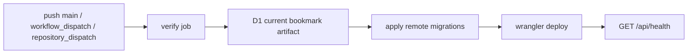

# 部署架构与发布手册

## 1. 当前生产资源

| 资源 | 当前值 | 配置来源 |
|---|---|---|
| 生产域名 | `beenhere.arr2018.dpdns.org` | `apps/web/wrangler.jsonc` custom domain |
| Worker | `project-been-here` | `wrangler.jsonc:name` |
| 入口 | `apps/web/worker/index.ts` | `wrangler.jsonc:main` |
| 静态资源 | Vite 产物 `apps/web/dist/client` → binding `ASSETS` | `wrangler.jsonc:assets` + Cloudflare Vite Plugin |
| D1 | `beenhere-records` → binding `DB` | `wrangler.jsonc:d1_databases` |
| Durable Object | SQLite-backed `PresenceRoom` → binding `PRESENCE` | `wrangler.jsonc:durable_objects` + `exports` |
| SMTP | TLS 465 | 非敏感端点在 `vars`，凭据在 Worker Secrets |
| 可观测性 | Workers Logs 开启，采样率 100% | `wrangler.jsonc:observability` |

`workers_dev=false`、`preview_urls=false`，生产服务只通过唯一 custom domain 暴露。D1 的实际 UUID 只维护在 `wrangler.jsonc`，文档不重复，避免漂移。

生产 build 同时生成浏览器产物 `dist/client` 和 Worker 产物 `dist/project_been_here`。Cloudflare Vite Plugin 会生成重定向后的部署配置，且必须保留 `PRESENCE` binding 与 `PresenceRoom` export；Wrangler 部署日志中的 “Using redirected Wrangler configuration” 属正常行为。`dist/` 与 `.wrangler/` 都是可重建、被忽略的产物，不得手工编辑或提交；原始配置仍是 `apps/web/wrangler.jsonc`。

## 2. 配置源优先级

1. 仓库中的源码、迁移、`wrangler.jsonc` 和 `.github/workflows/ci.yml`。
2. Cloudflare 当前 Worker/D1/Secret 名称与 deployment 结果。
3. GitHub Actions 当前运行与 environment 配置。
4. 本文；若与 1–3 冲突，以实时配置为准并立即修正文档。

不要在 Cloudflare Dashboard 临时修改普通 vars、route 或 binding 后不回写 `wrangler.jsonc`；下一次部署可能覆盖这些漂移。

## 3. 环境变量与 Secrets

### Worker 非敏感 vars（入库）

| 名称 | 用途 |
|---|---|
| `APP_ENV=production` | 开启生产 Origin 与 HSTS 行为。 |
| `SITE_URL` | 邮件链接和同源校验基址。 |
| `SMTP_HOST` / `SMTP_PORT` | SMTP TLS 端点。 |
| `SMTP_FROM_NAME` | 邮件发件人显示名。 |

### Worker Secrets（只存 Cloudflare）

| 名称 | 用途 | 轮换影响 |
|---|---|---|
| `SESSION_SECRET` | 会话令牌 HMAC | 轮换后所有现有会话立即失效。 |
| `SMTP_USERNAME` | SMTP 登录和 envelope sender | 与 SMTP_PASSWORD 同步轮换。 |
| `SMTP_PASSWORD` | SMTP 授权凭据 | 错误会使所有事务邮件失败。 |
| `SUPERADMIN_EMAILS` | 注册时授予馆长角色的邮箱列表 | 只影响后续注册，不改已有账户角色。 |

仅检查名称：

```bash
cd apps/web
npx wrangler secret list
```

设置时交互输入，避免写入 shell history：

```bash
npx wrangler secret put SESSION_SECRET
npx wrangler secret put SMTP_USERNAME
npx wrangler secret put SMTP_PASSWORD
npx wrangler secret put SUPERADMIN_EMAILS
```

`wrangler secret put/delete` 会创建并立即部署新的 Worker 版本，因此按生产变更处理。Cloudflare 官方说明见 [Workers Secrets](https://developers.cloudflare.com/workers/configuration/secrets/)。

### GitHub

| 类型 | 名称 | 用途 |
|---|---|---|
| Repository/Environment Secret | `CLOUDFLARE_API_TOKEN` | CI 执行 D1 与 Worker 部署。 |
| Repository/Environment Variable | `CLOUDFLARE_ACCOUNT_ID` | 指定 Cloudflare account。 |
| Environment | `production` | 部署环境和生产 URL。 |

值不得进入仓库、Actions 日志、issue、截图或文档。

## 4. 权威 CI/CD 链路

当前可验证的权威链路：



触发条件：

- push 到 `main`：验证并部署生产。
- pull request 到 `main`：只验证，不部署。
- `workflow_dispatch`：人工触发验证与部署。
- `repository_dispatch` 类型 `content-published`：外部内容流程可触发部署。

`verify` job：

1. 检出代码，Node.js 24，`npm ci`。
2. 检查根目录只保留 `README.md` 与 `AGENTS.md` 两份 Markdown。
3. 执行 `npm run check`：typecheck、Vitest、生产 build。

`deploy` job：

1. 再次 `npm ci` 与 build。
2. 获取 D1 当前 Time Travel bookmark，上传为保留 7 天的 Actions artifact。
3. `wrangler d1 migrations apply beenhere-records --remote`。
4. `wrangler deploy`。
5. 对生产 `/api/health` 重试验证。

Wrangler 部署时按 `exports` 声明创建或维护 Durable Object namespace；它与 D1 migration 是两套独立生命周期。新增、重命名或删除 Durable Object class 必须审查生产 binding 和 Worker 回滚兼容性。

同一 ref 使用 concurrency 组，新提交会取消旧的在途运行。

### Cloudflare Workers Builds 状态

2026-09-01 的可验证证据中，最新提交只有 GitHub Actions 的 `verify` 与 `deploy` check，实际 deployment source 为 Wrangler。当前运维凭据没有读取 Workers Builds trigger 的权限，因此平台侧 Git trigger 状态为 `unknown`，不能作为生产发布依赖，也不应与 GitHub Actions 同时承担权威部署。若以后启用，必须记录 trigger、branch、root directory、build/deploy commands、watch paths，并避免一条提交重复部署。官方机制见 [Workers Builds](https://developers.cloudflare.com/workers/ci-cd/builds/)。

## 5. 标准发布

```bash
git status --short
npm run check
git diff --check
git add <明确文件>
git commit -m "<清晰意图>"
git push origin main
gh run list --workflow "CI and deploy" --branch main --limit 1
gh run watch <run-id> --exit-status
curl --fail https://beenhere.arr2018.dpdns.org/api/health
```

完成条件：目标提交在 `origin/main`；verify 与 deploy 都 success；生产 health 返回 `ok`。页面可见不等于邮件、登录或 D1 写链路通过；按变更风险补充业务烟测。

## 6. 数据库迁移

1. 新增递增迁移文件，禁止改写已发布迁移。
2. 本地应用并运行全量门禁。
3. 评估旧 Worker 是否能读取新 schema，以及新 Worker 是否能读取旧 schema。
4. 对破坏性变更采用 expand → deploy → contract 的多次发布，不与代码回滚形成不兼容。
5. CI 在部署代码前保存 bookmark 并应用迁移。

迁移列表：

```bash
cd apps/web
npx wrangler d1 migrations list beenhere-records --remote
```

## 7. 首次或重建环境

以下步骤只用于明确授权的新环境或灾难重建，不用于日常发布：

1. `npx wrangler d1 create beenhere-records --location apac`。
2. 把返回的 database ID 写入 `apps/web/wrangler.jsonc`。
3. `npm run db:migrate:remote`。
4. 交互写入四个 Worker Secrets。
5. 配置 GitHub secret、variable 与 `production` environment。
6. `npm run deploy` 创建 Worker、Assets、D1 binding 与 custom domain。
7. 验证 health、公共页面、注册邮件和账户登录。

删除/重建 D1 会永久丢失当前数据库，必须先确认数据、恢复点和授权。

## 8. 紧急人工部署

正常情况只走 GitHub Actions。CI 平台故障且已获授权时：

```bash
npm ci
npm run check
cd apps/web
npx wrangler d1 time-travel info beenhere-records
npx wrangler d1 migrations apply beenhere-records --remote
cd ../..
npm run deploy
curl --fail https://beenhere.arr2018.dpdns.org/api/health
```

人工部署不会自动创建 GitHub artifact；必须把 bookmark、提交 SHA、操作者、时间和验证结果写入事故记录。

## 9. 发布后验证

- `GET /api/health` 为 200。
- `/`、`/auth/login`、`/studio` 返回本站 SPA，不出现第三方认证跳转。
- 未登录 `GET /api/account/me` 返回 401。
- 恶意 Origin 的写请求返回 403。
- 涉及账户邮件时，用受控测试账户验证 SMTP 接受、收件和一次性链接；验收后清理测试数据。
- 涉及 schema 时核对迁移列表和关键只读计数。
- 涉及在线状态时，用两个不同 visitor UUID 建立 WebSocket，验证第一个收到 1、两个连接都收到 2，并确认恶意 Origin 握手返回 403。

回滚与恢复步骤见 [OPERATIONS.md](OPERATIONS.md)。
